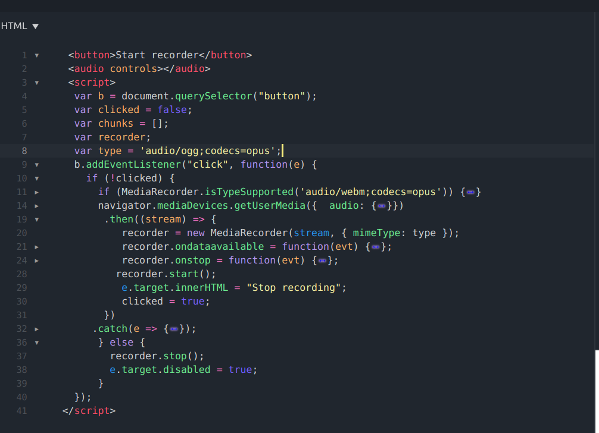
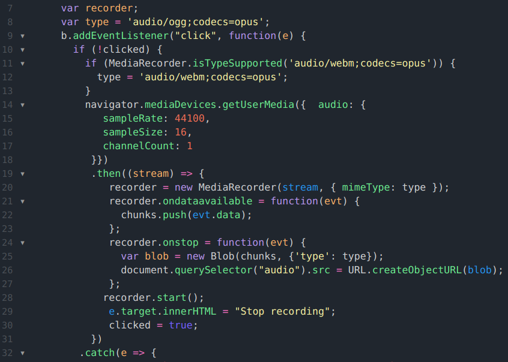

#### Learn Coding - audio recorder in javascript

Learn javascript code required to run a recorder / audio player.
Use a powerful code editing and code run environment in your browser.
Make a short audio recording and play it back while you browse/ learn
the short simple code that runs the media session.
#### Run the code
You can use the [editor on JSFiddle](https://jsfiddle.net/rowntreerob/nchu17x6/) to inspect / run the code.

#### Instructions:
 Use the start button to make a short recording. Stop recording
with the stop button. Click the Play control for playback of your audio.
Find the buttons/controls in the lower right-hand quadrant of the JSFiddle screen.

Lower right - run view:


#### Line by line, learn code
Lines #1 , 2 define HTML while the script tag in #3 thru #41 is a block of Javascript code. HTML puts 2 things on the user interface: a button and the playback controls. Recorder
start , recorder stop
are controlled by a button with a text label that is revised according to the status of
the recorder ( is paused, is started).
Find more info on html5 tags (button, audio ) [here](https://www.w3schools.com/tags/)

Line #3 to the end is javascript code inserted within the html using a "script" tag.

#### controlling the recorder

* an HTML button controls start and stop actions on the voice Recorder
* a separate variable holds a boolean value indicating whether the button has already been clicked ie that the recorder was started already
* Look for the javascript variables __"b" "clicked"__ in Lines #4, 5, 9 30. The start button is represented by the variable `b`. the boolean variable is `clicked` . Note that the label on the button changes from "start" to "stop" in parallel with the value of 'clicked'
#### first click
*  __clicked__ variable #5 gets initial value of false. The record button has not been clicked when the code starts off and the first time its clicked, the code reaches #10 with __clicked__ still at "false".
* The first of 2 "if" conditions #10,  allows lines from 11 to 31 to be invoked on the first time the start button is clicked.
* lines 20 - 28 use regular behavior of the [MediaRecorder class](https://developer.mozilla.org/en-US/docs/Web/API/MediaRecorder) to define how to handle raw data from the microphone and how start/ stop the recorder.
* more explain on MediaRecorder [here](https://www.twilio.com/blog/mediastream-recording-api)
#### 2nd click stops recorder
* see lines 29, 30 which change the button's label to "stop record" and set __clicked__ variable to true. This true value shows that the recorder "is running" so that the next button click will stop the recorder.
* with __clicked__ equal to true, look at #10 which uses the "!" syntax checking for a "not true". The ! operator reverses the logical (true or false) state of the value so the following can occur: the 2nd time that the button is clicked  # 10
is asking "if not true". Not-true  evaluates to false because __clicked__ is true. The "false "  portion of the if statement runs at #37 and the recorder is stopped.

#### details on audio data
* lines 15 - 17 supply details on how the audio is stored in computer binary codes. more info on "channel-count, sample-size, sample-rate" [here](https://developer.mozilla.org/en-US/docs/Web/Media/Formats/Audio_concepts#Audio_data_format_and_structure)
#### accessing recorded media in the browser
* raw microphone data delivered by the computer-system to this app is bundled in a __buffer__. At a rate of a 15 a second, an arriving buffer with its data just gets added to a javascript array. See __chunks__ variable at line 22.
* when the recording is stopped, all of the array-data is converted to a form of audio media that is playable by the player controls from line 2. The `blob` at line 25 is a file-like object on which a URL reference can be created and the value of the URL passed to the player.
* line 26 passes the URL, setting an attribute called "src" that belongs to the control. Now the player is configured to playback the audio file created using data from the mic.  
Review  [how-to on JSFiddle](https://www.dummies.com/web-design-development/javascript/jsfiddle-and-javascript/) to inspect / run the code.  

Whenever you commit to this repository, GitHub Pages will run [Jekyll](https://jekyllrb.com/) to rebuild the pages in your site, from the content in your Markdown files.


```markdown
Syntax highlighted code block

# Header 1
## Header 2
### Header 3

- Bulleted
- List

1. Numbered
2. List

**Bold** and _Italic_ and `Code` text

[Link](url) and 
```

For more details see [GitHub Flavored Markdown](https://guides.github.com/features/mastering-markdown/).
